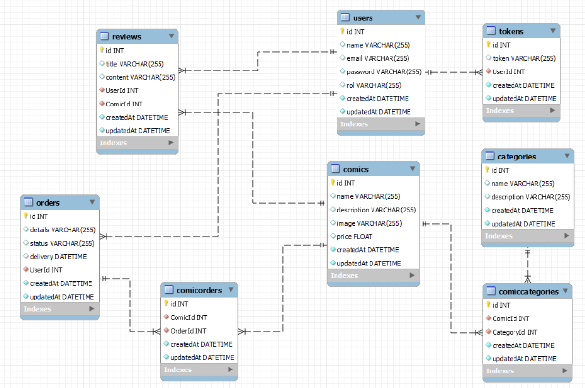
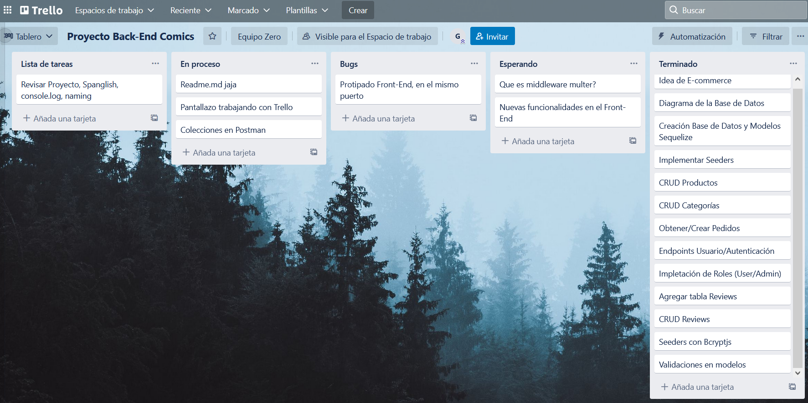

# Comic Shop

_Proyecto desarollado en Nodejs que emula el Back-End de una tienda de comics online_

## Tecnologías utilizadas 🚀

El proyecto ha sido desarrollado utilizando las siguientes tecnologías:

* Express
* Mysql
* Sequelize
* Bcryptjs
* Jsonwebtoken
* Multer
* Dotenv

## ¿Como desplegar el proyecto? 📋

Estas instrucciones te permitirán obtener una copia del proyecto en funcionamiento en tu máquina local para propósitos de desarrollo:

Clonarte el repositorio localmente:
> git clone <url del repositorio>

Instalar las depedencias necesarias:
> npm i

Rellenar las variables necesarias en estos archivos para iniciar el proyecto:
> config.example.json -> Incluir campos Username, Password, Database
> .env.example -> Puerto en el que quieras que se ejecute el server y jwt_secret para la utilización de jsonwebtoken en la autenticación del usuario

Creamos la base de datos:
> sequelize db:create

Creamos las migraciones:
> sequelize db:migrate

Creamos los seeders (datos de prueba para nuestra base de datos):
> sequelize db:seed:all

😊 Genial ya tenemos todo listo para poder llamar a los endpoints y recibir datos 😊
## Modelo de la base de datos 🔧

El diagrama de nuestra base de datos:

 

## Endpoints 🛠️

El sistema puede realizar las siguientes acciones:

- CRUD Comics
- CRUD Categorias
- CRUD Pedidos
- CRUD Usuarios
- CRUD Reviews
- Encriptación de ciertos campos mediante Bcryptjs
- Proceso de autenticación mediante jsonwebtoken
- El sistema permite administrar a los usuarios por roles
- Proceso para poder adjuntar archivos con las imagenes de los comics mediante multer

Para ver mas detalladamente el funcionamiento de cada endpoints consultar el siguiente enlace:

  
## 📌 Organización a la hora de trabajar en este proyecto 📌

El proyecto consta de dos ramas: main y develop, las distintas funcionalidades del proyecto se han implementado en distintas ramas que posteriormente se han fusionado con la rama develop que es la encargada de actualizar todo el trabajo de desarrollo. Finalmente cuando tengamos versiones estables de la rama develop la fusionamos con la rama main, la encargada de mostrar nuestro Back-End en producción.

Se han organizado las tareas siguiendo un tablero de trabajo de Trello:

 

---
Hecho por [Germán Fernández](https://github.com/GeerDev) 😊 